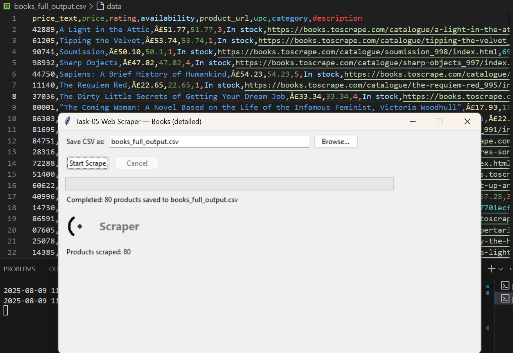

## Task-05 - 🌐 Web Scraping Project 🤖🕸️

## 🚀 Project Overview
This project shows how to extract data from websites using **Python**!
Using powerful libraries like **requests** and **BeautifulSoup**, you can scrape useful info, process it, and save it for your analysis. Perfect for data lovers and automation enthusiasts! 📊✨

---

## ✨ Features
-Fetches webpage content using HTTP requests
-Parses HTML content to extract required data
-Handles pagination or multiple pages (if implemented)
-Saves scraped data to CSV files for further analysis
-Easy to customize for different websites or data types

---

## 🛠️ Technologies Used
-🐍 Python 3.x
-📡 requests
-🍲 BeautifulSoup4

---

## 📷 Screenshots



---

## 🙋‍♀️ Developed By

**Vaishnavi Lalan**  
💼 Software Development Intern at Prodigy Infotech  
🔗 [GitHub Profile](https://github.com/VaishnaviLalan106)

---

## 📂 Folder structure
```
PRODIGY_SD_05/
│
├── venv/                     
│   ├── Include/
│   ├── Lib/
│   └── Scripts/
│
├── .gitignore                
├── pyvenv.cfg                
├── README.md                
├── webscriper_gui.py          
├── books_full_output.csv    
└── scraper.log   
```
---  

